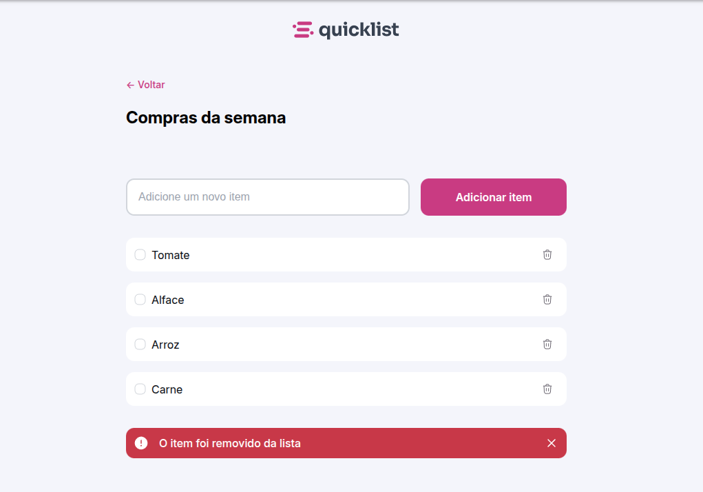

# 📋 Quicklist

O **Quicklist** é uma aplicação web simples e responsiva para criação de listas de compras, desenvolvida como parte do curso **Full-Stack** da [Rocketseat](https://www.rocketseat.com.br/), com base em um template fornecido via Figma. O projeto permite adicionar, marcar e remover itens dinamicamente, com feedback visual através de animações suaves de opacidade.

---

## ✨ Funcionalidades

- ✅ Adicionar novos itens à lista
- 🗑️ Remover itens da lista com animação de desaparecimento
- ⚠️ Exibir aviso visual ao remover um item
- 🎯 Interface responsiva baseada em mobile-first
- 🎨 Visual moderno com base no Figma oficial da Rocketseat

---

## 📷 Preview

> Exemplo de interface disponível ao executar o projeto localmente:

---

## 🛠 Tecnologias

Este projeto foi desenvolvido utilizando:

- **HTML5**
- **CSS3 (com variáveis customizadas e responsividade)**

## 📄 Licença

Este projeto foi desenvolvido apenas para fins de aprendizado e não possui uma licença específica.

#### Att: monwire
